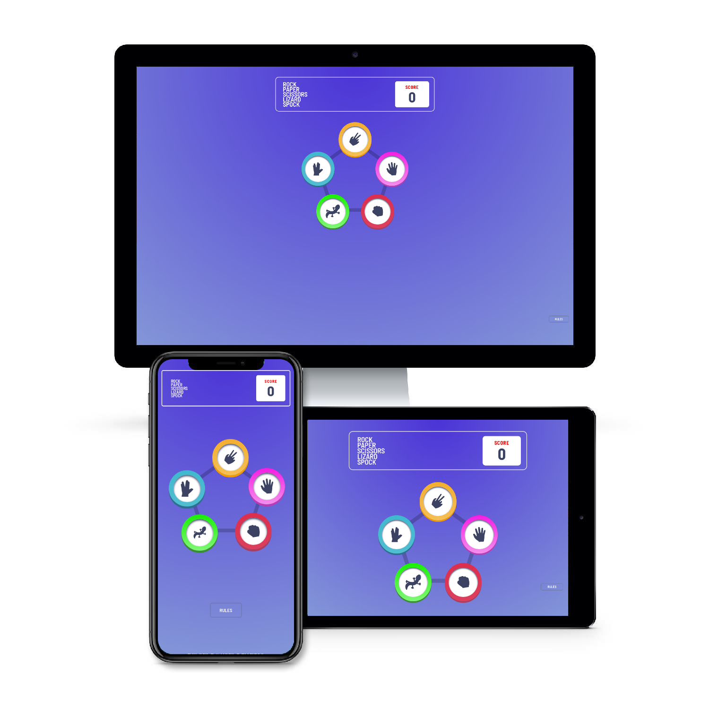
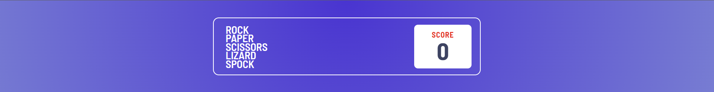
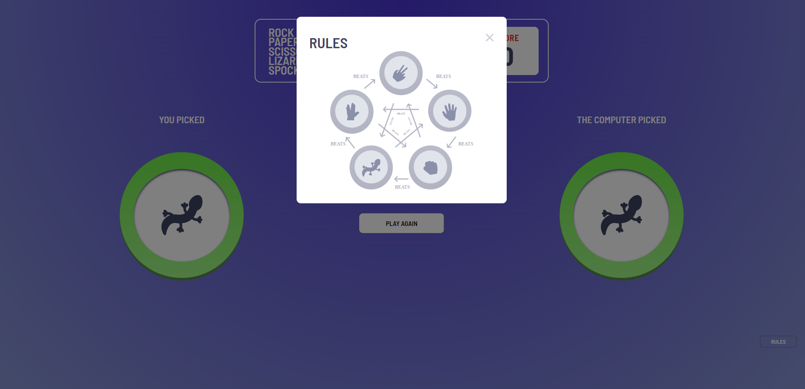
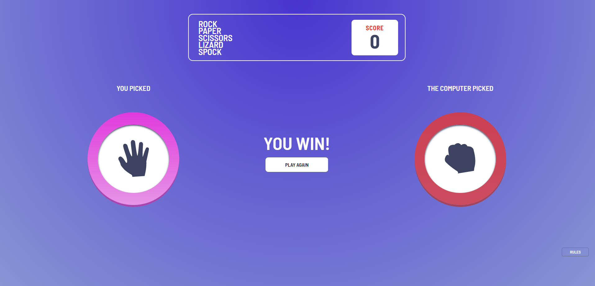

## Rock, Paper, Scissors, Lizard, Spock

 Rock, Paper, Scissors, Lizard, Spock is the geek version of the classic Rock, Paper, Scissors game. Rock, Paper, Scissors, Lizard, Spock is created by [Sam Kass and Karen Bryla.](http://www.samkass.com/theories/RPSSL.html)
 
  

 

## [View the deployed website here!](https://e01n.github.io/Rock-Paper-Scissors-Lizard-Spock/)
---

# User experience (UX)

- __Visitors__
  - The users of the site should imediatly recognise how the games works.

  - The users should find the buttons interactive and responsive.

  - The users should find the game easy to navigate and fun to play. 

 # Design
- __Colour Scheme__

  - The site has an array of different colours, all which are eaisly distiguishable from each other.

- __Typography__

  - The main font for the site is Barlow Semi Condensed with Sans-Serif as back-up. I used the back-up font Sans-serif because most browsers will be compatiable with it.

- __Imagery__

  - The website uses simple yet effective images which clearly indicate each option. The images are used make the user want to play the game and interact with the website.

# Technologies Used

- __Languages__

  - HTML
  - CSS
  - JavaScript

# Features

- __Header__
  - The header is centered at the top of the screen with a simple design with the name on the left.
  - The score count is located at the right of the header with a contrasting background so that the user can easily see it. The score counter will keep track of the users progress.

  
 
- __Game box__

    - The game box is at the center of the page so that it is obvious to the user. 
    - The game box has five different options to choose from which are all coloured individually so that 
    
  

- __The rules button__
    - The rules button is at the bottom right of the page for easy access to the user.

    - When the user clicks on the button a modal box will pop up with the rules of the game. 

- __Game Buttons__

    - The user can clearly see the different choices of rock, paper, scissors, lizard, spock.

    - Using icons for the buttons gives a clear understanding what the user is pressing. 

    - The mouse curser changes to a pointer so the user understands that this is a button.

    - The buttons colour fills the area when the user hovers over it with the mouse. It's striking and will attract the users attention.

- __Player and computer choices__

    - This area of the game shows what the user picked and what the computer picked. 

    - Font colour in white for contrast against purple background, so it's  clear for the user to see. 

    - the users choice will display next to the "You Picked:" and "The Computer picked:" statements.

    - In this area the user can clearly see the outcome of the round

    - The outcome will be displayed in the center of the page 

    - If the user wins "YOU WIN!" will be displayed, if the users looses the round "YOU LOSE!" will be shown and if it's a draw "DRAW" will be shown

- __Play again button__

    - The play again button takes the user back to select another option for the next round.

    - The button has a color transition when hovered over. 

# Testing

  ### Accesibility Testing 

- I used Lighthouse DevTools test to assess the pages accesibility and it scored an overall of 97

### Validator Testing 

- HTML
  - No errors returned when passing through the official [W3C validator](https://validator.w3.org/nu/?doc=https%3A%2F%2Fe01n.github.io%2FProject-Portfolio-2%2F)
- CSS
  - No errors were found when passing through the official [(Jigsaw) validator](https://jigsaw.w3.org/css-validator/validator?uri=https%3A%2F%2Fe01n.github.io%2FProject-Portfolio-2%2F&profile=css3svg&usermedium=all&warning=1&vextwarning=&lang=en)

- Javscript

    - The javascript page was put through Js Hint and came out with no errors.

# Deployment

- Deployment of the site was done on GitHub. The steps of how are as follows:

    - Click on repository "Rock-Paper-Scissors-Lizard-Spock" from my account. From there navigate to settings.

    - On the left side of the page under "code and automation" click on pages.

    - Select "main" in the Branch, then you will be provided a link that will take youto the completed website

# Credits

- While reserching for this project i came across [FrontEndMentor.io](https://www.frontendmentor.io/challenges/rock-paper-scissors-game-pTgwgvgH/hub/rock-paper-scissors-game-r1bgjB6Hq) where there is a challenge for this project. There are assets, JPG images of the design files and a basic style guide for you to use, so i took advantage of that and used it as a foundation of this project.

- Part of my javascipt code was taken from a youtube video found [here.](https://www.youtube.com/watch?v=lV2BMXdsDmc)

- I was helped a lot from the community at [stackoverflow.com](https://stackoverflow.com/) where i was able to find answers to problems i came across during the coding of this project.
